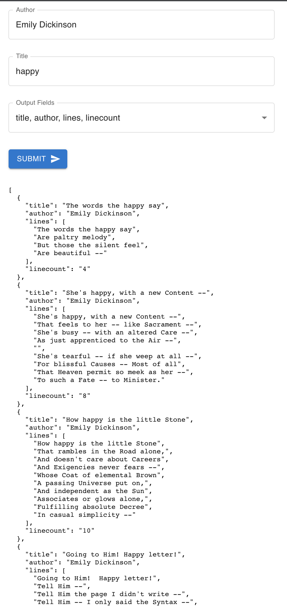

# the-poet
Blustaq Pre-Interview Code Challenge - The Poet
---

## Description
This program uses the poetrydb API (https://github.com/thundercomb/poetrydb/blob/master/README.md) to query for poems by author and title. It also allows the user to specify which output fields they wish to see results for.

## Usage
Run `npm start` in the `/the-poet` directory. 
The webpage is automatically hosted at localhost:3000. React also allows for using a different port at startup if the 3000 port is already being used, just press `y` when prompted and go to the address shown in the terminal.

## Next Steps
- Implement Select All/Unselect All options for the output fields multiselect
- Implement poemcount functionality of the poetrydb API to allow user to limit results
- Implement random functionality of the poetrydb API
- Allow user to select format of output (text or json) / download results
- Allow user to decide if search should be exact match or not
- Add input validation to prevent user from making queries that result in errors
- Make output prettier
    - Show the results in a table
    - Allow further sorting/searching of results
    - Pagination of results